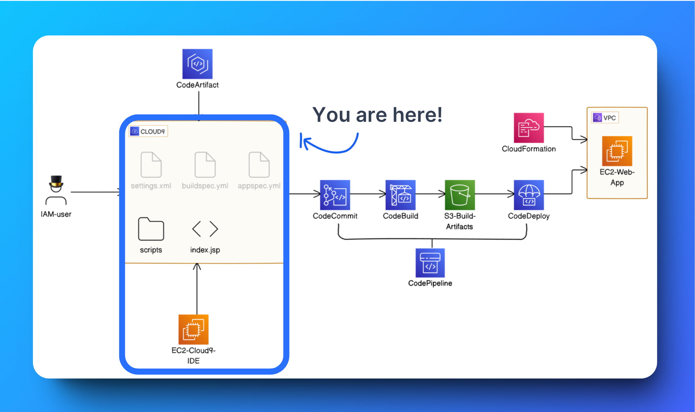

# AWS Web App and IDE Deployment
This project demonstrates the deployment of a web application and an Integrated Development Environment (IDE) using various AWS services. The architecture leverages AWS CodeCommit, CodeBuild, CodeDeploy, and CloudFormation for continuous integration and delivery (CI/CD), alongside other services like EC2, S3, and IAM.

## Project Overview
This project involves deploying a Java-based web application onto an EC2 instance using a structured CI/CD pipeline. The setup includes the following key steps:

## IAM User Configuration:

- Configured AWS Identity and Access Management (IAM) users, following AWS 
  best practices.
- Avoided using the root user for daily operations, ensuring a secure 
  environment.
## Development Environment Setup:

- Launched an EC2 instance and configured it with Visual Studio Code (VS 
  Code) as the Integrated Development Environment (IDE).
- Installed and configured Apache Maven and Java on the EC2 instance to 
  manage and build the web application.
## Web Application Development:

- Used Maven to initialize and structure the Java web application project.
- Created essential configuration files, such as settings.xml, 
  buildspec.yml, and appspec.yml, necessary for build and deployment 
  processes.
## CI/CD Pipeline:

- CodeCommit: Used AWS CodeCommit for version control to store the source 
  code.
- CodeBuild: Configured AWS CodeBuild to automate the build process, compiling the code and running tests.
- S3: Stored build artifacts in an S3 bucket for later deployment stages.
- CodeDeploy: Automated the deployment of the application onto an EC2 
  instance.
- CloudFormation: Utilized AWS CloudFormation to provision and manage the 
  necessary infrastructure.
# Architecture Diagram



# How to Deploy
- # Clone the Repository:

bash
```
git clone <repository-url>
cd <repository-directory>
```
- # Configure AWS CLI:

- Ensure that the AWS CLI is configured with the necessary IAM user credentials.
- # Initialize Maven Project:

Copy code

```
mvn clean install
```
- # Run the CI/CD Pipeline:

- Push your code changes to the CodeCommit repository.
- Monitor the build and deployment process via the AWS Management Console.
- # Access the Application:

- Once the deployment is complete, access the web application through the public IP address of the EC2 instance.
# Prerequisites
- AWS account with sufficient permissions.
- IAM user configured with AWS CLI access.
- Knowledge of Java and Maven.
- Basic understanding of AWS services like EC2, S3, CodeCommit, CodeBuild, and CodeDeploy.
# Conclusion
This project showcases a practical implementation of deploying a Java web application using AWS's CI/CD tools, providing a robust and scalable environment for continuous development and deployment.

